# 🏃 悦动宝 JoyMove — 亲子运动陪伴平台

> 让运动成为家庭最温暖的陪伴 · 用 AI 为每个孩子定制成长报告

[](https://spring.io/)
[](https://www.java.com/)
[](https://www.mysql.com/)
[](https://redis.io/)
[](https://www.docker.com/)
[](https://deepseek.com/)
[](LICENSE)

---

## 📸 项目截图

| 首页 | 数据看板 |
|:---:|:---:|
| 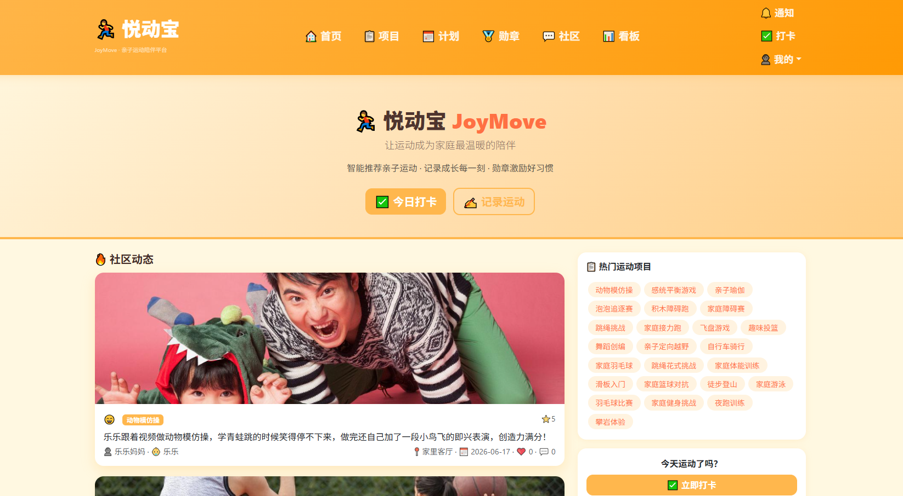 | 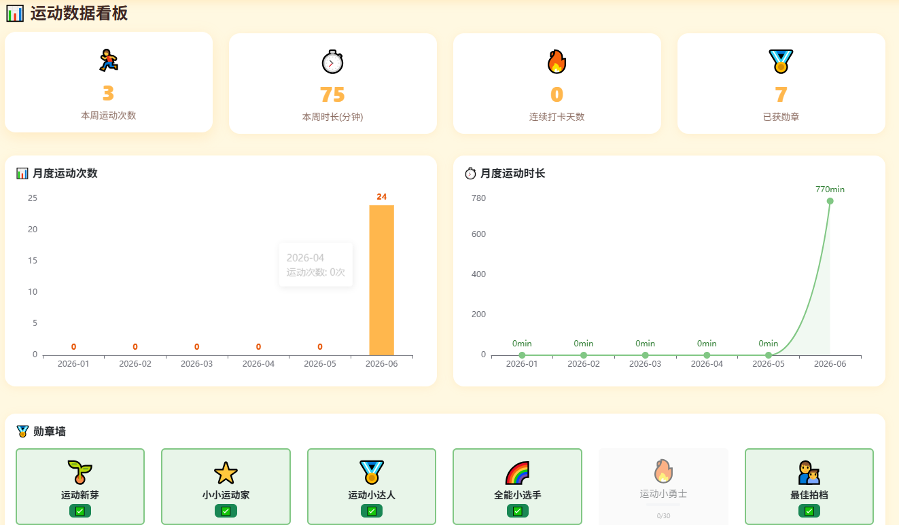 |

| 打卡页面 | 勋章馆 |
|:---:|:---:|
| 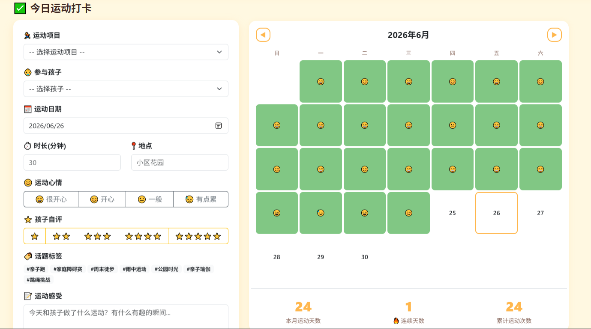 | 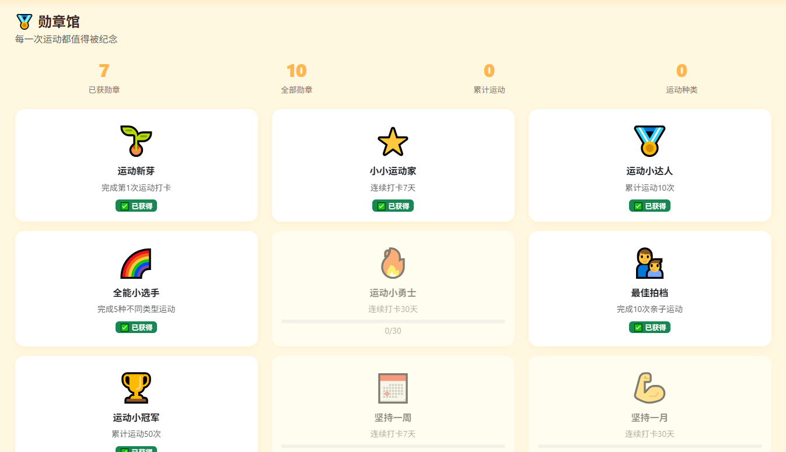 |

| 社区动态 | 运动项目库 & AI 推荐 |
|:---:|:---:|
| 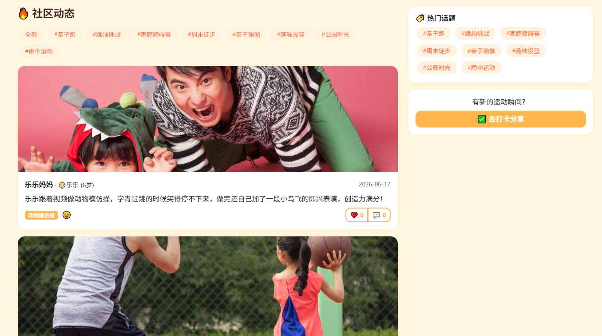 | 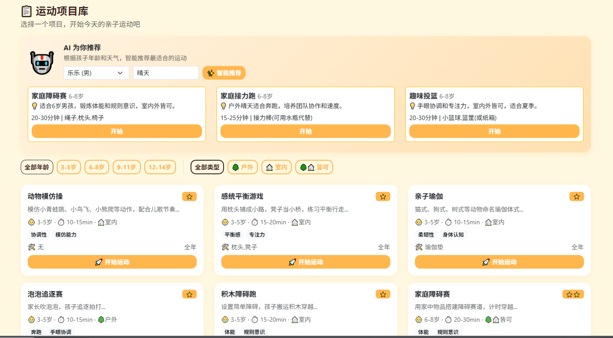 |

| 运动计划 | AI 月度报告 |
|:---:|:---:|
| 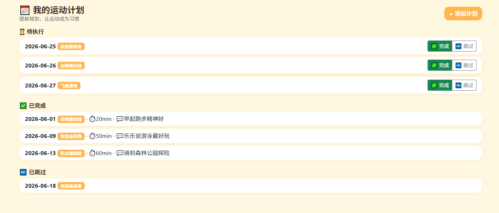 | 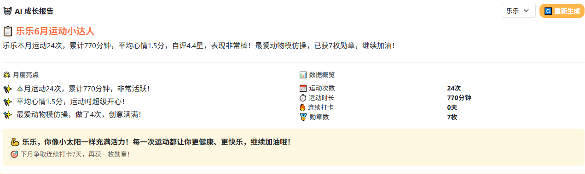 |

| 运动指导 | 个人中心 | 管理后台 |
|:---:|:---:|:---:|
| 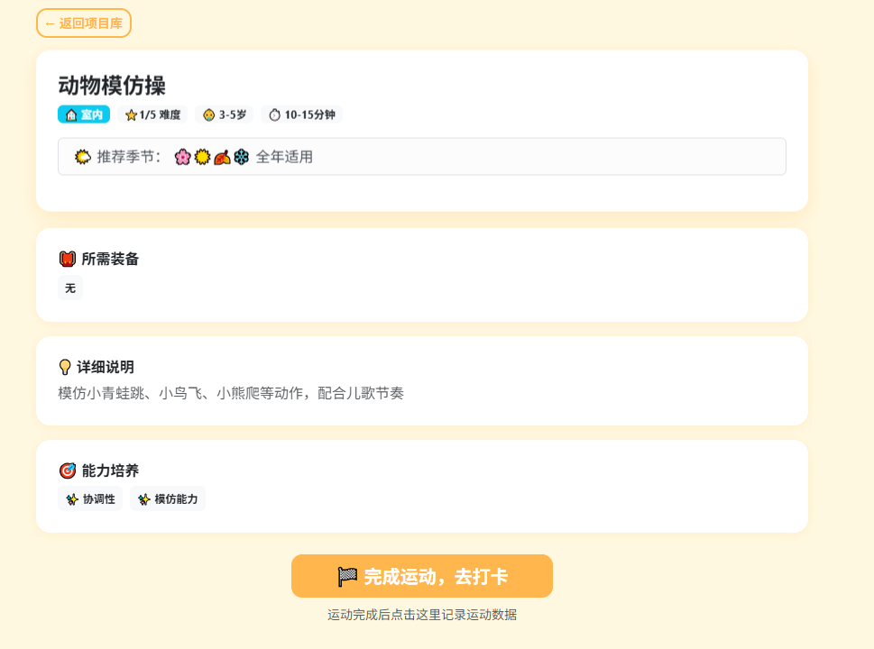 | 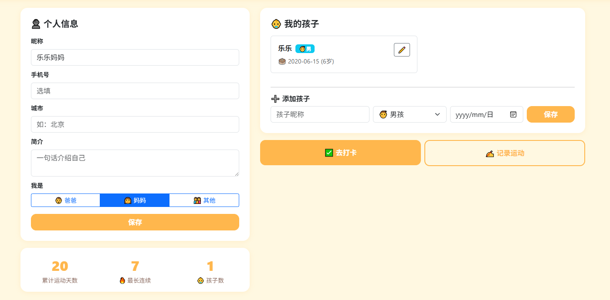 | 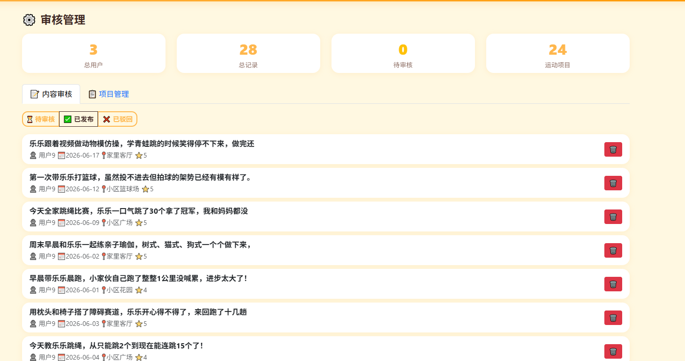 |

---

## 🎯 项目定位

面向 3-14 岁儿童家庭的亲子运动陪伴平台。帮助家长解决"不知道玩什么"的痛点，通过 **AI 智能推荐 + 打卡记录 + 数据看板 + 勋章激励** 四大模块，让运动成为家庭情感连接的方式。

**核心用户流程：** 注册 → 添加孩子 → AI推荐运动 → 打卡记录 → 获得勋章 → 数据看板 → AI月报

---

## 🏗️ 技术架构

```
┌─────────────────────────────────────────────────────┐
│                    前端 (SSR)                        │
│      Thymeleaf + Bootstrap 5 + ECharts 5 + jQuery   │
├─────────────────────────────────────────────────────┤
│                   Controller (10个)                  │
│    RESTful API + 页面路由 + Spring Security 鉴权     │
├─────────────────────────────────────────────────────┤
│                   Service (9个)                      │
│   业务逻辑 + 勋章规则引擎 + AI客户端 + 推荐降级       │
├─────────────────────────────────────────────────────┤
│                   Mapper (11个)                      │
│   MyBatis-Plus BaseMapper + 自定义 SQL + 分页        │
├─────────────────────────────────────────────────────┤
│                   MySQL 8.0 (12表)                   │
│   utf8mb4 · 逻辑删除 · 自动填充 · 索引优化            │
├─────────────────────────────────────────────────────┤
│                   AI 集成                             │
│   DeepSeek V4 API · Prompt 工程 · JSON结构化输出      │
│   Fallback: 规则引擎兜底，API故障不影响功能            │
└─────────────────────────────────────────────────────┘
```

---

## 🐳 Docker 部署（推荐）

```bash
docker-compose up --build
```

三容器编排（MySQL + Redis + App），首次构建 5-10 分钟。启动后 `http://localhost:8080`。

---

## 🚀 本机开发启动

### 前置条件
- JDK 1.8+
- MySQL 8.0
- Maven 3.6+

### 步骤 1：创建数据库

```sql
CREATE DATABASE IF NOT EXISTS sports_blog DEFAULT CHARSET utf8mb4;
```

### 步骤 2：初始化表结构和种子数据

```bash
mysql -u root -p sports_blog < src/main/resources/init.sql
```

### 步骤 3：配置 DeepSeek API Key

编辑 `src/main/resources/application.yml`：

```yaml
deepseek:
  api:
    key: sk-your-deepseek-api-key    # 替换为真实 Key
```

> 不配置 API Key 也不影响使用 — AI 功能会自动降级到规则引擎

### 启动

```bash
mvn spring-boot:run
```

浏览器打开 `http://localhost:8080`，使用 `admin / admin123` 登录体验。

---

## 📊 核心功能模块

| 模块 | 功能 | 技术亮点 |
|---|---|---|
| 🤖 **AI 运动推荐** | 根据孩子年龄+天气+季节推荐运动项目 | DeepSeek API + Prompt 工程 + JSON 结构化输出 + 规则引擎 fallback |
| 📝 **AI 月度报告** | 自动生成温暖的月度成长报告 | 数据聚合 + LLM 文案生成 + 缓存去重 |
| ✅ **运动打卡** | 运动记录 + 月度日历 + 连续天数 | 记录即打卡，自动计算 streak |
| 📊 **数据看板** | KPI卡片 + 趋势图 + 项目分布 + 时间线 | ECharts 5，独立双轴图表 |
| 🏅 **勋章系统** | 10枚勋章 + 进度条 + 自动授予 | 规则引擎，打卡/运动后自动触发 |
| 💬 **社区互动** | 信息流 + 话题标签 + 点赞 + 评论 | 楼中楼嵌套，toggle 点赞 |
| 📋 **运动项目库** | 24个项目 + 年龄/类型筛选 | 按 3-5/6-8/9-11/12-14 岁分层 |
| 📅 **运动计划** | 个人计划 + 完成/跳过 + 反馈 | 日历视图，关联运动项目库 |
| 👤 **用户系统** | 注册(含孩子信息) + 个人中心 | Spring Security + BCrypt + 多孩子支持 |
| ⚙️ **管理后台** | 内容审核 + 项目管理 + 统计面板 | RBAC 权限，审核通过/驳回/删除 |

---

## 📡 API 端点（30+）

### 运动记录
| Method | Path | Description |
|--------|------|-------------|
| POST | `/api/moment/create` | 创建运动记录（打卡） |
| GET | `/api/moment/list` | 用户记录列表（分页） |
| GET | `/api/moment/calendar` | 月度运动日历 |
| GET | `/api/moment/{id}` | 记录详情（JSON） |

### AI
| Method | Path | Description |
|--------|------|-------------|
| GET | `/api/ai/recommend` | AI 运动推荐 |
| GET | `/api/ai/report` | AI 月度成长报告 |

### 社区
| Method | Path | Description |
|--------|------|-------------|
| GET | `/api/community/feed` | 社区信息流 |
| GET | `/api/community/hot-tags` | 热门话题标签 |
| POST | `/api/community/like` | 点赞/取消 |
| POST | `/api/community/comment` | 评论 |

### 数据看板
| Method | Path | Description |
|--------|------|-------------|
| GET | `/api/dashboard/overview` | 看板总览 |
| GET | `/api/dashboard/trend` | 月度趋势 |
| GET | `/api/dashboard/timeline` | 成长时间线 |

### 勋章
| Method | Path | Description |
|--------|------|-------------|
| GET | `/api/medals/progress` | 勋章进度 |
| GET | `/medals` | 勋章馆页面 |

### 管理员
| Method | Path | Description |
|--------|------|-------------|
| GET | `/admin/api/stats` | 平台统计 |
| GET | `/admin/api/moments` | 审核列表 |
| POST | `/admin/activity/audit` | 审核操作 |
| POST | `/admin/api/project/save` | 项目管理 |
| DELETE | `/admin/activities/{id}/permanent` | 永久删除 |

---

## 🧠 AI Prompts 设计

### 运动推荐 Prompt

```
System: 你是一个专业的亲子运动规划师。根据孩子的年龄、性别、季节、天气
        和可用运动项目列表，推荐最合适的亲子运动项目。

User:   孩子：6岁男孩。季节：夏季。天气：晴天28°C。
        可用项目：[家庭障碍赛(ID:6,6-8岁,室内外皆可)...]
        请推荐3个项目，返回JSON格式。
```

**关键设计决策：**
- `temperature=0.4` — 保证推荐稳定可复现
- `response_format: json_object` — 强制 JSON 输出，避免解析失败
- `max_tokens=1024` — 控制成本，每次约 0.01 元
- **fallback 机制** — API 异常时自动降级到规则引擎（年龄+季节+历史偏好加权打分）

---

## 📁 项目结构

```
src/main/java/com/sportsblog/
├── SportsBlogApplication.java       # 主启动类
├── common/                           # Result<T> · ResultCode · BusinessException · GlobalExceptionHandler
├── config/                           # Security · MyBatis-Plus · WebMvc · RestTemplate · GlobalModelAdvice
├── controller/                       # 10个 Controller
│   ├── IndexController              # 首页 + 搜索
│   ├── UserController               # 注册 · 登录 · 个人中心 · 孩子管理
│   ├── FamilyMomentController       # 运动记录 · 打卡
│   ├── CheckInController            # 独立打卡 API
│   ├── FamilyPlanController         # 运动计划 · 项目库
│   ├── CommunityController          # 社区 · 点赞 · 评论
│   ├── DashboardController          # 数据看板
│   ├── MedalController              # 勋章馆
│   ├── AIController                 # AI 推荐 · 月报
│   ├── AdminController              # 审核 · 项目管理 · 统计
│   └── NotificationController       # 通知
├── entity/                           # 11个实体 (Lombok + MyBatis-Plus注解)
├── mapper/                           # 11个 Mapper接口 + XML
├── service/                          # 9个 Service接口
│   └── impl/                        # 9个 ServiceImpl
│       ├── AIRecommendationService   # DeepSeek推荐 + 降级
│       ├── AIMonthlyReportService   # DeepSeek月报 + 模板fallback
│       ├── AIClientService           # DeepSeek API 客户端
│       ├── MedalServiceImpl          # 勋章规则引擎
│       └── ...
└── dto/                              # 8个 DTO/VO
```

---

## 🛠️ 技术栈

| 类别 | 技术 | 版本 |
|------|------|------|
| 后端框架 | Spring Boot | 2.7.18 |
| ORM | MyBatis-Plus | 3.5.5 |
| 数据库 | MySQL | 8.0 |
| 缓存 | Redis + Spring Cache | 7 |
| 安全 | Spring Security + BCrypt | — |
| 异步 | @Async + 自定义线程池 | — |
| API 文档 | springdoc-openapi | 1.7.0 |
| 前端 | Thymeleaf + Bootstrap 5 + jQuery | — |
| 图表 | ECharts | 5.4 |
| AI | DeepSeek API | — |
| 容器 | Docker + docker-compose | — |
| 构建 | Maven | 3.6+ |
| Java | JDK | 1.8 |

---

## 🔑 演示账号

| 角色 | 用户名 | 密码 | 说明 |
|------|--------|------|------|
| 管理员 | `admin` | `admin123` | 审核管理 + 项目管理 |
| 家长 | `mama` | `admin123` | 已有运动数据，可直接看看板 |

---

## 📝 待办

- [ ] 补充 AI Prompt 工程文档
- [ ] Service 层单元测试补充

---

## 📄 License

MIT © 2026 JoyMove
